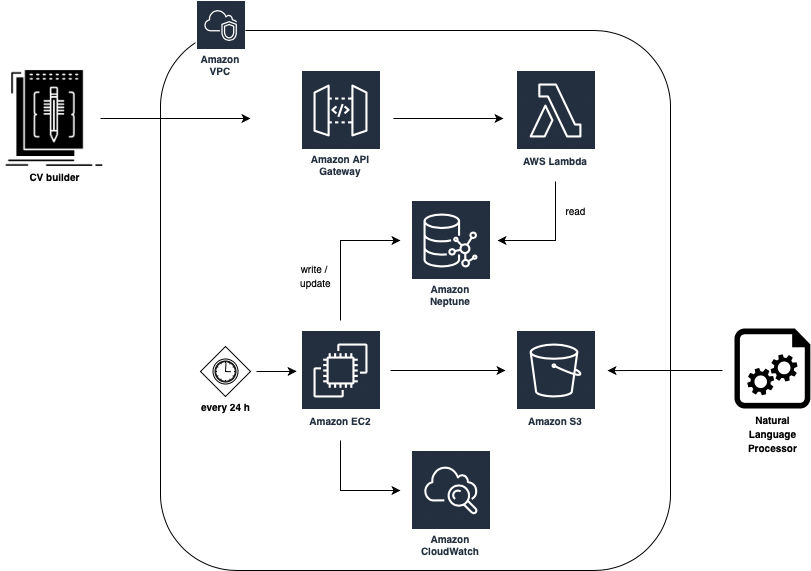

# Skills Recommendation Engine :briefcase:
The objective of this Bachelor project is to develop a software component of [Efio](https://efio.dk)'s Moon project. This repository contains the code for a prototype of a Skills Recommendation Engine while providing all of the needed IaC. The goal of the project was to match a specified skill with all its related concepts. Furthermore, a sample project exemplifying how to use the developed API is provided through a Slack app that can also be found in the root folder. 

</br>

---
## User manual :bookmark_tabs:
In order to use the project with another data set, the simplest approach would be to have an AWS account where the solution can be deployed. As a starting point, this repository should be forked to another Github account. From there, some elements of the [CloudFormation yml](https://github.com/elit0451/SkillsRecommendationEngine/blob/master/CloudFormation.yml) file would need to be changed, along with some of the other references in the project to accommodate one's personal needs.

The most important ones are to be listed below but you are more than welcomed to have a look at the rest of the infrastructure settings and adjust them to your likings :slightly_smiling_face: :
- CloudFormation [github repo link](https://github.com/elit0451/SkillsRecommendationEngine/blob/341c3acaf2e9932cc9ccec31eb2b8691a5edc56a/CloudFormation.yml#L8);
- Neptune cluster [endpoint](https://github.com/elit0451/SkillsRecommendationEngine/blob/341c3acaf2e9932cc9ccec31eb2b8691a5edc56a/SkillQuerier/terraform/staging/terraform_stg.tf#L42) - both in **terraform_stg.tf** and **terraform_prod.tf** files;
- [S3 bucket name](https://github.com/elit0451/SkillsRecommendationEngine/blob/341c3acaf2e9932cc9ccec31eb2b8691a5edc56a/NeptuneSkillImporter/src/Program.cs#L24) where job posts are stored;
- To alter the white-listed skills for the database nodes, change the [csv file](https://github.com/elit0451/SkillsRecommendationEngine/blob/master/NeptuneSkillImporter/src/data/skills-dataset.csv) with your own list;
- The JSON job post schema should obey the following standardized format:
```json
{
	"Title": {
		"description": "The title of the job post",
		"type": "string"
	},
	"Price": {
		"description": "The offered amount of money for the job",
		"type": "string"
	},
	"Location": {
		"description": "The place where the job will be hosted",
		"type": "string"
	},
	"JobPostUrl": {
		"description": "The URL where job post was scrapped from",
		"type": "string"
	},
	"FullJobPost": {
		"description": "The provided description in the job post",
		"type": "string"
	},
	"TimeStamp": {
		"description": "The date record when the job was published",
		"type": "string"
	},
	"JobPostUrlHash": {
		"description": "The hash of the job post URL",
		"type": "string"
	},
	"keywords": {
		"description": "(Optional) A list of all tech keywords found in the post",
		"type": "array",
		"minItems": 1,
		"uniqueItems": true
}
```
- Before running the tests locally, a local Gremlin server should be running;
- All the roles mentioned throughout the terraform files should be changed accordingly.

</br>

---
## API documentation :incoming_envelope:
If you want to contact the system's exposed API, the following things need to be taken into account:
> Endpoint: https://7dq5d3f0yb.execute-api.eu-west-1.amazonaws.com/production/relatedskills </br>
> Method: POST </br>
> Body: {"**limit**":"[number of related skills to be displayed]","**skillName**":"[the name of the skill]"}

</br>

---
## Specifics :desktop_computer:
- .Net Core 
- Amazon Web Services 
- Terraform 

</br>

---
## Solution Architecture :building_construction:
<p align="center">
</p>
<p align="center">
<em>Skills Recommendation Engine architecture</em>
</p>
</br>

We have created 2 applications within this project: 

**Populator** - This is the main brain of the system (Amazon Neptune, EC2, CloudWatch and S3). It is responsible for inserting and updating the contents of the Neptune graph database.

**Querier** - It supplies the bridge between the external world and the main system by exposing an API that provides controlled access to the persisted data. This part can be identified through the diagram by the combination of Amazon API Gateway, AWS Lambda and Neptune.   

**External components** - Slack app, CV builder and NLP, where the first one is a PoC also developed by the team.

</br>

Links to the applications - [Populator](https://github.com/elit0451/SkillsRecommendationEngine/tree/master/NeptuneSkillImporter), [Querier](https://github.com/elit0451/SkillsRecommendationEngine/tree/master/SkillQuerier) and [SkillRecommendationApp](https://github.com/elit0451/SkillsRecommendationEngine/tree/master/SkillRecommendationApp).

</br>

----
## CI/CD :link:
CI/CD set up is provided for all the components in this repository with the help of Terraform and AWS CodeBuild. In order to get further information about the topic, you can have a look at CodeBuild **BuildSpec** [scripts](https://github.com/elit0451/SkillsRecommendationEngine/blob/341c3acaf2e9932cc9ccec31eb2b8691a5edc56a/CloudFormation.yml#L182) present in the CloudFormation file, as well as the files stored in the **terraform** folders of the projects.

</br>

---
> #### Assignment made by:   
`David Alves 👨🏻‍💻 ` :octocat: [Github](https://github.com/davi7725) <br />
`Elitsa Marinovska 👩🏻‍💻 ` :octocat: [Github](https://github.com/elit0451) <br />
> Attending a Software Development bachelor's degree
